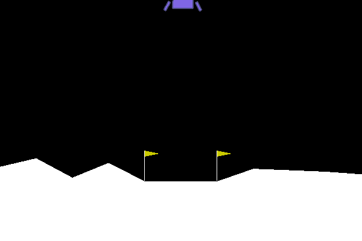

# Landing on the moon with Asynchronous Advantage Actor Critic (A3C) Algorithm :rocket::moon: #
This repository contains the code of the project for the Lunar Landing Continuos v2 by OpenAI Gym

The purpose of this project is to create stability and high performance for Moon Landing using A3C based on Deep Q-Learning, one of the most well-known algorithms for Deep Reinforcement Learning and its improvements, test them on the Lunar Lander environment from OpenAI gym. The results of the experiments show that, while the extensions to the base algorithm improved its performances greatly, the simpleness of the environment prevents us from identifying a clear winner.

Read the paper-like report for the project [here](https://github.com/gnpaone/Lunar-Landing/blob/main/minipaper.pdf).



## Dependencies ##
- [Tensorflow v2](https://tensorflow.org)
- [OpenAI gym](https://gym.openai.com/)
- [NumPy](https://numpy.org/) 
- [Matplotlib](https://matplotlib.org/)
- [Box2D](https://box2d.org/)

### Lunar-Lander-Continuos-v2.ipynb ###
This file contains the main code, which creates the agents and launches them.

## Optional Arguments ##
Parameters can be changed for the Actor and Critic networks by changing:

 ```python
 policy_net_args = {"num_Hlayers": 2,
                       "activations_Hlayers": ["relu", "relu"],
                       "Hlayer_sizes": [100, 100],
                       "n_output_units": 2,
                       "output_layer_activation": tf.nn.tanh,
                       "state_space_size": 8,
                       "action_space_size": 2,
                       "Entropy": 0.01,
                       "action_space_upper_bound": action_space_upper_bound,
                       "action_space_lower_bound": action_space_lower_bound,
                       "optimizer": tf.train.RMSPropOptimizer(0.0001),
                       "total_number_episodes": 5000,
                       "number_of_episodes_before_update": 1,
                       "frequency_of_printing_statistics": 100,
                       "frequency_of_rendering_episode": 1000,
                       "number_child_agents": 8,
                       "episodes_back": 20,
                       "gamma": 0.99,
                       "regularization_constant": 0.01,
                       "max_steps_per_episode": 2000

                       }

    valuefunction_net_args = {"num_Hlayers": 2,
                              "activations_Hlayers": ["relu", "relu"],
                              "Hlayer_sizes": [100, 64],
                              "n_output_units": 1,
                              "output_layer_activation": "linear",
                              "state_space_size": 8,
                              "action_space_size": 2,
                              "optimizer": tf.train.RMSPropOptimizer(0.01),
                              "regularization_constant": 0.01}

````
